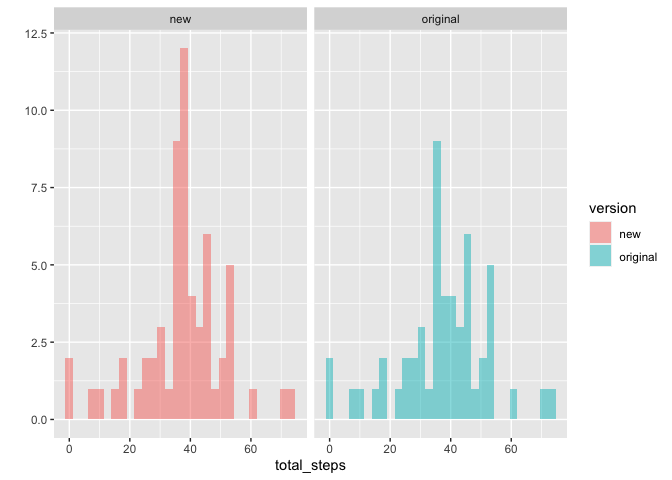

## Loading and preprocessing the data
This is the code for loading and processing data into analytical one, the main procesures are:

1. Read data from a csv file;
2. Create a new variable of time from 'date' and 'intervals', thus we could know the exact time of recording;
3. Set the 'steps' count into a numeric vector for following analysis.

Here is the code:

```r
library(dplyr)
unzip("activity.zip")
data=read.csv("activity.csv",stringsAsFactors = F)
data[,3]=sprintf("%04d", data[,3])
data=data%>%mutate(time=paste(date,interval))
data=data%>%mutate(time=as.POSIXct(strptime(time,format="%Y-%m-%d %H%M")))
data=data%>%mutate(steps=as.numeric(steps))
```


## What is mean total number of steps taken per day?
<!-- -->

As illustrated in the histogram graph above, the mean total number of steps taken per day is around 37.

## What is the average daily activity pattern?

<!-- -->

As the average steps pattern shown above, on general, our test takers walked 206.17 steps in 5 minutes at 08:35, which is the peak of the data.

## Imputing missing values
<!-- -->

13% of the original data are NAs. I replaced them with the average values of all non-missing records of the same interval. 

The histogram above illustrates the distribution of new data. We could find that the new data has a peak around 37 which is the mean/median of all non-missing data.

The mean value of total steps of the original data and new data are 37.3826 and 37.3826 respectively, which are exactly the same.The median of these two data set are 37.378472 and 37.3826, which are quite close to each other under previous imputting strategy.

## Are there differences in activity patterns between weekdays and weekends?
<!-- --><!-- -->

Compare two patterns in the graph above, we could see that the walking pattern in weekdays have four obvious peaks around 8:00, 12:00, 16:00 and 19:00, which shows a general moving pattern in our daily weekdays. 

In contrast, the pattern of weekends is flatter, and later than weekdays. Generally, in weekends, people tend to get up later, enjoy activities with walking more in the afternoon and night.
